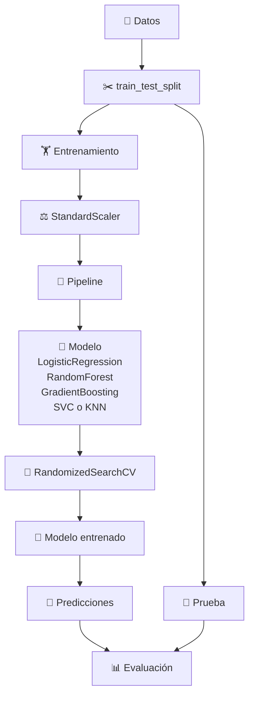
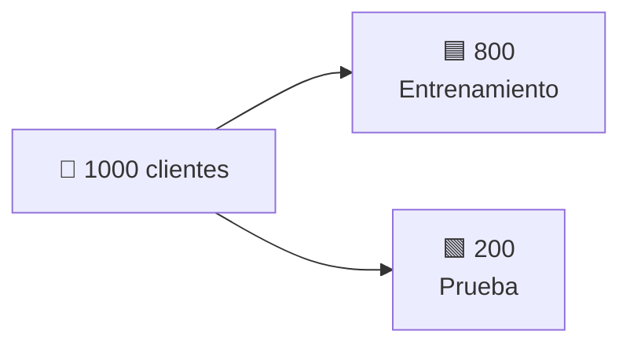
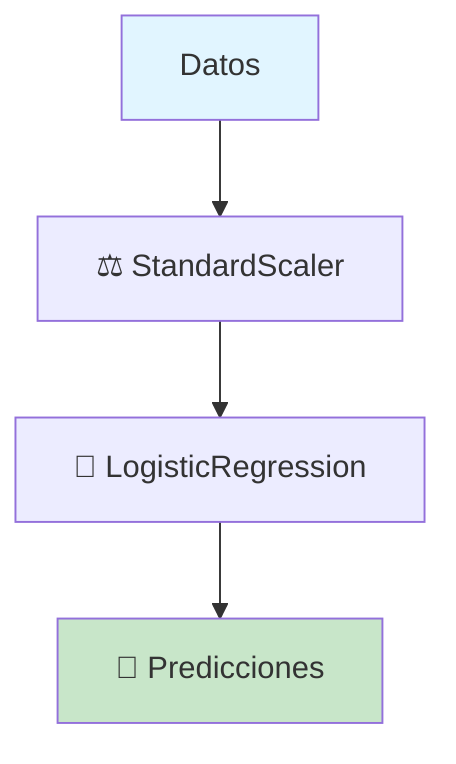
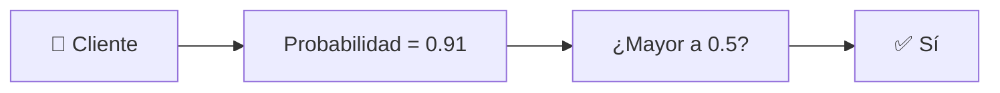
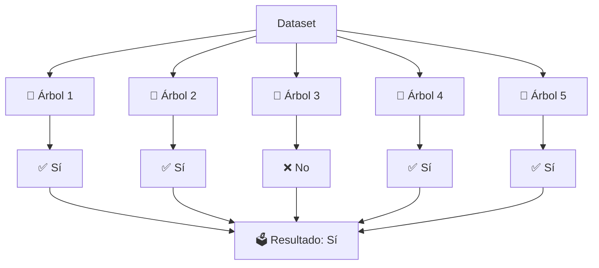
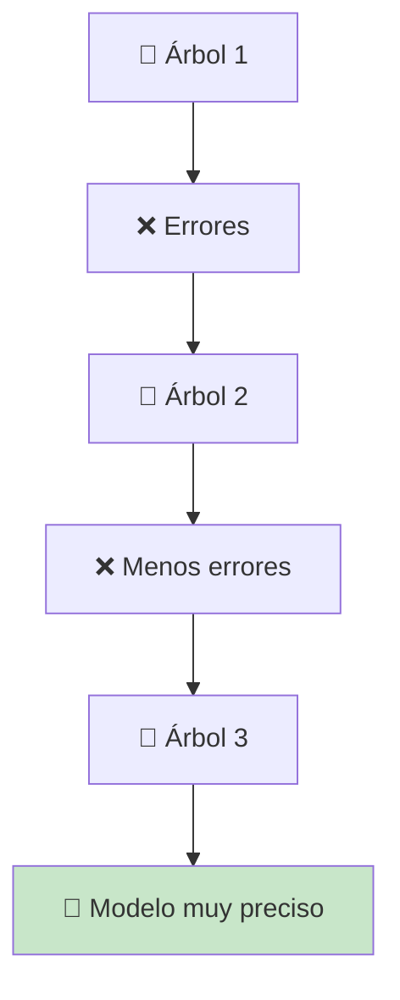
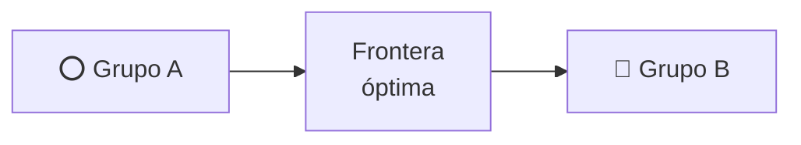
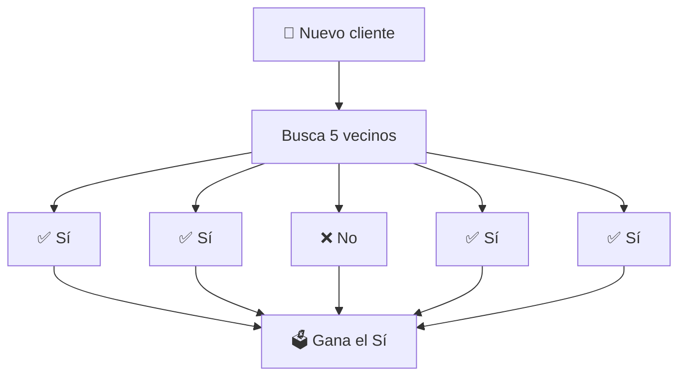
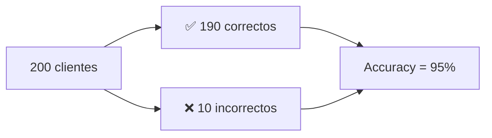
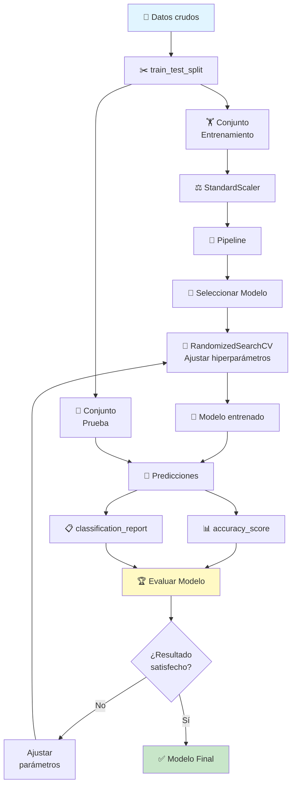

🚀🤖 # Machine Learning con Scikit-Learn

📚 ## Guía práctica de los algoritmos de clasificación más utilizados

«💡 Este documento explica de forma sencilla cómo funciona un proyecto de Machine Learning utilizando Scikit-Learn, desde la preparación de los datos hasta la evaluación del modelo.»

---

📖 ## Contenido

- 📌 Problema de ejemplo
- ✂️ "train_test_split"
- ⚖️ "StandardScaler"
- 🔄 "Pipeline"
- 📈 "LogisticRegression"
- 🌳 "RandomForestClassifier"
- 🚀 "GradientBoostingClassifier"
- 📐 "SVC"
- 👥 "KNeighborsClassifier"
- 🎯 "RandomizedSearchCV"
- 📊 "accuracy_score"
- 📋 "classification_report"
- 🏆 Comparación de algoritmos
- 🔄 Flujo completo del proyecto

---

🎯 ## Problema de ejemplo

Imaginemos que una empresa quiere saber si un cliente cancelará su suscripción.

Cada cliente posee información como la siguiente:

| 👤 Edad | 📅 Meses | 💰 Gasto | 📞 Reclamos | 🎯 Canceló |
|---------|----------|----------|-------------|-----------|
| 25      | 3        | 25       | 4           | ✅ Sí     |
| 41      | 36       | 80       | 0           | ❌ No     |
| 30      | 8        | 40       | 2           | ✅ Sí     |
| 58      | 72       | 120      | 0           | ❌ No     |

Nuestro objetivo será entrenar un modelo que pueda responder automáticamente:

«¿Este cliente cancelará o no?»

---

🛣️ Flujo completo del proyecto



---

✂️ train_test_split

🎯 ¿Para qué sirve?

Divide los datos en dos conjuntos.

| Conjunto | Propósito | Descripción |
|----------|-----------|-------------|
| 🏋️ Entrenamiento | El modelo aprende | Datos utilizados para entrenar el modelo |
| 🧪 Prueba | El modelo demuestra lo aprendido | Datos para validar el rendimiento real |

```python
from sklearn.model_selection import train_test_split

X_train, X_test, y_train, y_test = train_test_split(
    X,
    y,
    test_size=0.20,
    random_state=42
)
```

📦 Ejemplo de división:



«💡 Nunca debemos entrenar con los datos de prueba.»

---

⚖️ StandardScaler

🎯 ## ¿Qué problema resuelve?

Las variables poseen escalas diferentes.

| Variable | Valores | Problema |
|----------|---------|----------|
| 👤 Edad | 18 - 80 | Rango pequeño |
| 💰 Gasto | 10 - 1000 | Rango grande (puede tener más peso) |

**Después de escalar:**

| Variable | Valores escalados |
|----------|------------------|
| Edad | -1.5 ... 2.0 |
| Gasto | -1.8 ... 1.7 |

🎉 Ahora todas las variables tienen una importancia similar.

---

🔄 ## Pipeline

Un Pipeline conecta automáticamente todos los pasos.



Sin Pipeline:
```
Escalar → Entrenar → Predecir
```

Con Pipeline:
```python
Pipeline([
    ("scaler", StandardScaler()),
    ("modelo", LogisticRegression())
])
```

✨ Todo ocurre automáticamente.

---

📈 ## LogisticRegression

🧠 Idea principal

Calcula una probabilidad.



✅ Ventajas

| Ventaja | Descripción |
|---------|-------------|
| ⚡ Muy rápida | Ideal para datasets grandes |
| 📈 Excelente para comenzar | Buena línea base de referencia |
| 🔍 Fácil de interpretar | Entendible para no técnicos |

---

🌳 ## RandomForestClassifier

🧠 Idea principal

Construye muchos árboles de decisión. Cada árbol vota.



🎯 ¿Por qué funciona tan bien?

- Cada árbol es diferente
- Los errores individuales se compensan entre sí
- Reduce el overfitting

---

🚀 ## GradientBoostingClassifier

🧠 Idea principal

En lugar de crear árboles independientes, cada árbol aprende de los errores del anterior.



Es como un profesor corrigiendo continuamente a un estudiante.

---

📐 ## SVC (Support Vector Classifier)

🧠 Idea principal

Busca la mejor frontera para separar dos grupos.



| Característica | Descripción |
|---|---|
| Busca | La mejor frontera de separación |
| Ventaja | Muy preciso en problemas complejos |
| Ideal para | Datos no linealmente separables |

---

👥 ## KNeighborsClassifier

🧠 Idea principal

Busca los vecinos más parecidos.



Es uno de los algoritmos más intuitivos.

---

🎯 ## RandomizedSearchCV

🤔 ¿Qué hace?

Busca automáticamente la mejor configuración del modelo.

| Configuración | Profundidad | Árboles | Accuracy |
|---|---|---|---|
| Opción 1 | 5 | 100 | 94% |
| Opción 2 | 8 | 200 | **96%** ✅ |
| Opción 3 | 10 | 150 | 95% |

🏆 Mejor opción

En lugar de probar cientos de combinaciones manualmente...

🤖 Lo hace automáticamente.

---

📊 ## accuracy_score

Mide el porcentaje de aciertos.



| Resultado | Predicción |
|---|---|
| Accuracy = 95% | Mientras más cercano a 100%, mejor |
| Accuracy = 100% | Modelo perfecto |
| Accuracy = 50% | Peor que una moneda |

---

📋 ## classification_report

Es un informe mucho más completo.

| Clase | Precision | Recall | F1-score |
|-------|-----------|--------|----------|
| No    | 0.95      | 0.97   | 0.96     |
| Sí    | 0.93      | 0.90   | 0.91     |

### 📌 Precision

De todas las veces que el modelo dijo Sí... ¿Cuántas acertó?

Fórmula: TP / (TP + FP)

---

### 📌 Recall

De todos los casos realmente positivos... ¿Cuántos encontró?

Fórmula: TP / (TP + FN)

---

### 📌 F1-score

Es un equilibrio entre Precision y Recall.

Cuanto más cercano a 1, mejor será el modelo.

---

🏆 ## Comparación de algoritmos

| 🤖 Algoritmo | ⭐ Dificultad | ⚡ Velocidad | 🎯 Precisión | 📝 Nota |
|---|---|---|---|---|
| 📈 Logistic Regression | ⭐ | ⭐⭐⭐⭐⭐ | ⭐⭐⭐ | Excelente inicio |
| 🌳 Random Forest | ⭐⭐ | ⭐⭐⭐⭐ | ⭐⭐⭐⭐⭐ | Muy versátil |
| 🚀 Gradient Boosting | ⭐⭐⭐ | ⭐⭐⭐ | ⭐⭐⭐⭐⭐ | Máxima precisión |
| 📐 SVC | ⭐⭐⭐ | ⭐⭐ | ⭐⭐⭐⭐ | Complejo |
| 👥 KNN | ⭐ | ⭐⭐ | ⭐⭐⭐ | Simple |

---

🔄 ## Resumen visual del flujo completo



---

🎉 ## Conclusión

Un proyecto de Machine Learning no consiste únicamente en entrenar un algoritmo.

Es un proceso donde:

| Paso | Acción | Importancia |
|------|--------|-------------|
| 📂 | Se preparan los datos | Crítica |
| ✂️ | Se dividen en entrenamiento y prueba | Crítica |
| ⚖️ | Se normalizan cuando es necesario | Alta |
| 🔄 | Se automatiza el flujo con un Pipeline | Alta |
| 🤖 | Se prueban distintos modelos | Alta |
| 🎯 | Se optimizan hiperparámetros con RandomizedSearchCV | Alta |
| 📊 | Se evalúan resultados con métricas objetivas | Crítica |
| 🏆 | Se selecciona el modelo que mejor generaliza | Crítica |

«⭐ La calidad del modelo depende tanto de los datos como de una correcta preparación y evaluación.»
