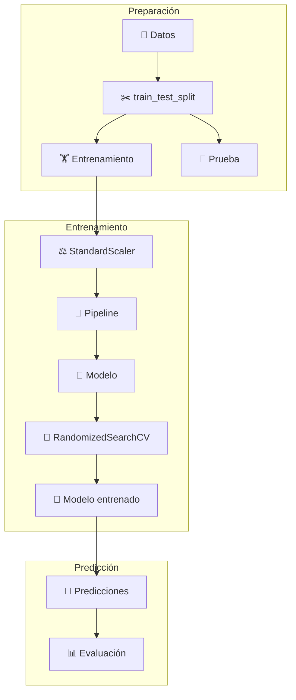

# 🚀🤖 Machine Learning con Scikit-Learn

## 📚 Guía práctica de los algoritmos de clasificación más utilizados

«💡 Este documento explica de forma sencilla cómo funciona un proyecto de Machine Learning utilizando Scikit-Learn, desde la preparación de los datos hasta la evaluación del modelo.»

---

## 📖 Contenido

- 📌 Problema de ejemplo
- ✂️ "train_test_split"
- ⚖️ "StandardScaler"
- 🔄 "Pipeline"
- 📈 "LogisticRegression"
- 🌳 "RandomForestClassifier"
- 🚀 "GradientBoostingClassifier"
- 📐 "SVC"
- 👥 "KNeighborsClassifier"
- 🎯 "RandomizedSearchCV"
- 📊 "accuracy_score"
- 📋 "classification_report"
- 🏆 Comparación de algoritmos
- 🔄 Flujo completo del proyecto

---

## 🎯 Problema de ejemplo

Imaginemos que una empresa quiere saber si un cliente cancelará su suscripción.

Cada cliente posee información como la siguiente:

| 👤 Edad | 📅 Meses | 💰 Gasto | 📞 Reclamos | 🎯 Canceló |
|--------:|---------:|---------:|------------:|:----------:|
| 25 | 3 | 25 | 4 | ✅ Sí |
| 41 | 36 | 80 | 0 | ❌ No |
| 30 | 8 | 40 | 2 | ✅ Sí |
| 58 | 72 | 120 | 0 | ❌ No |

Nuestro objetivo será entrenar un modelo que pueda responder automáticamente:

«¿Este cliente cancelará o no?»

---

## 🛣️ Flujo completo del proyecto

---

## ✂️ train_test_split

🎯 ¿Para qué sirve?

Divide los datos en dos conjuntos.

🏋️ Entrenamiento

El modelo aprende.

🧪 Prueba

El modelo demuestra lo aprendido.

from sklearn.model_selection import train_test_split

X_train, X_test, y_train, y_test = train_test_split(
    X,
    y,
    test_size=0.20,
    random_state=42
)

📦 Ejemplo

1000 clientes

🟦 800 → Entrenamiento

🟩 200 → Prueba

«💡 Nunca debemos entrenar con los datos de prueba.»

---

## ⚖️ StandardScaler

🎯 ¿Qué problema resuelve?

Las variables poseen escalas diferentes.

Variable| Valores
👤 Edad| 18 - 80
💰 Gasto| 10 - 1000

El algoritmo puede dar demasiada importancia a la variable con números más grandes.

Después de escalar:

Edad    -1.5 ... 2.0

Gasto   -1.8 ... 1.7

🎉 Ahora todas las variables tienen una importancia similar.

---

## 🔄 Pipeline

Un Pipeline conecta automáticamente todos los pasos.

Sin Pipeline:

Escalar

↓

Entrenar

↓

Predecir

Con Pipeline:

Pipeline([
    ("scaler", StandardScaler()),
    ("modelo", LogisticRegression())
])

✨ Todo ocurre automáticamente.

---

## 📈 LogisticRegression

🧠 Idea principal

Calcula una probabilidad.

Cliente

↓

Probabilidad = 0.91

↓

¿Mayor a 0.5?

↓

✅ Sí

✅ Ventajas

- ⚡ Muy rápida.
- 📈 Excelente para comenzar.
- 🔍 Fácil de interpretar.

---

## 🌳 RandomForestClassifier

🧠 Idea principal

Construye muchos árboles de decisión.

Cada árbol vota.

🌳 Árbol 1 → Sí

🌳 Árbol 2 → Sí

🌳 Árbol 3 → No

🌳 Árbol 4 → Sí

🌳 Árbol 5 → Sí

──────────────

🗳️ Resultado

Sí

🎯 ¿Por qué funciona tan bien?

Porque cada árbol es diferente.

Los errores individuales se compensan entre sí.

---

## 🚀 GradientBoostingClassifier

🧠 Idea principal

En lugar de crear árboles independientes...

Cada árbol aprende de los errores del anterior.

🌳 Árbol 1

↓

❌ Errores

↓

🌳 Árbol 2

↓

❌ Menos errores

↓

🌳 Árbol 3

↓

🎯 Modelo muy preciso

Es como un profesor corrigiendo continuamente a un estudiante.

---

## 📐 SVC (Support Vector Classifier)

🧠 Idea principal

Busca la mejor frontera para separar dos grupos.

⭕ ⭕ ⭕ ⭕

──────────────

🔵 🔵 🔵 🔵

La línea representa la mejor separación posible.

💪 Ventajas

- Muy preciso.
- Excelente para problemas complejos.

---

👥 ## KNeighborsClassifier

🧠 Idea principal

Busca los vecinos más parecidos.

👤 Nuevo cliente

↓

Busca 5 vecinos

✅ Sí

✅ Sí

❌ No

✅ Sí

✅ Sí

↓

🗳️ Gana el Sí

Es uno de los algoritmos más intuitivos.

---

## 🎯 RandomizedSearchCV

🤔 ¿Qué hace?

Busca automáticamente la mejor configuración del modelo.

Por ejemplo:

🌳 100 árboles

Profundidad 5

Accuracy = 94%

────────────

🌳 200 árboles

Profundidad 8

Accuracy = 96%

🏆 Mejor opción

En lugar de probar cientos de combinaciones manualmente...

🤖 Lo hace automáticamente.

---

📊 ## accuracy_score

Mide el porcentaje de aciertos.

Ejemplo:

200 clientes

✅ 190 correctos

❌ 10 incorrectos

Resultado:

Accuracy = 95%

Mientras más cercano a 100%, mejor.

---

##📋 classification_report

Es un informe mucho más completo.

              precision    recall    f1-score

No              0.95        0.97        0.96

Sí              0.93        0.90        0.91

### 📌  Precision

👉 De todas las veces que el modelo dijo Sí...

¿Cuántas acertó?

---

### 📌 Recall

👉 De todos los casos realmente positivos...

¿Cuántos encontró?

---

### 📌 F1-score

Es un equilibrio entre Precision y Recall.

Cuanto más cercano a 1, mejor será el modelo.

---

## 🏆 Comparación de algoritmos

🤖 Algoritmo| ⭐ Dificultad| ⚡ Velocidad| 🎯 Precisión
📈 Logistic Regression| ⭐| ⭐⭐⭐⭐⭐| ⭐⭐⭐
🌳 Random Forest| ⭐⭐| ⭐⭐⭐⭐| ⭐⭐⭐⭐⭐
🚀 Gradient Boosting| ⭐⭐⭐| ⭐⭐⭐| ⭐⭐⭐⭐⭐
📐 SVC| ⭐⭐⭐| ⭐⭐| ⭐⭐⭐⭐
👥 KNN| ⭐| ⭐⭐| ⭐⭐⭐

---

## 🔄 Resumen visual

📂 Datos
      │
      ▼
✂️ train_test_split
      │
      ▼
⚖️ StandardScaler
      │
      ▼
🔄 Pipeline
      │
      ▼
🤖 Modelo
      │
      ▼
🎯 RandomizedSearchCV
      │
      ▼
🧠 Modelo entrenado
      │
      ▼
🔮 Predicciones
      │
      ▼
📊 accuracy_score
📋 classification_report
      │
      ▼
🏆 Mejor modelo

---

## 🎉 Conclusión

Un proyecto de Machine Learning no consiste únicamente en entrenar un algoritmo.

Es un proceso donde:

- 📂 Se preparan los datos.
- ✂️ Se dividen en entrenamiento y prueba.
- ⚖️ Se normalizan cuando es necesario.
- 🔄 Se automatiza el flujo con un Pipeline.
- 🤖 Se prueban distintos modelos.
- 🎯 Se optimizan sus hiperparámetros con "RandomizedSearchCV".
- 📊 Se evalúan los resultados con métricas objetivas.
- 🏆 Se selecciona el modelo que mejor generaliza sobre datos nunca vistos.

«⭐ La calidad del modelo depende tanto de los datos como de una correcta preparación y evaluación.»
